# 📘 Complete Technical Documentation – Coolth Store V2 Energy Prediction System

This document provides a **comprehensive breakdown** of the V2 implementation, its structure, functionality, analysis, and visual outputs.

## 📁 Directory Structure & File Purposes

```text
project-root/
│
├── app.py                             # Flask API (main endpoint)
├── device_energy_prediction_api.md    # API documentation (markdown)
├── Dockerfile                         # For Cloud Run deployment
├── evaluate_lstm_model.py             # Evaluates model and plots results
├── feature_engineering.py             # Adds rolling stats, lag features etc.
├── generate_gpu_data.py               # Generates synthetic GPU JSON data
├── generate_refrigerator_data.py      # Generates synthetic refrigerator data
├── gpu_energy_model.h5                # Pretrained GPU model (v1)
├── gpu_synthetic_data.json            # Synthetic data (GPU type)
├── GUI AI DLC.png                     # Mockup of front-end dashboard
├── infer_local.py                     # Run inference locally for testing
├── lstm_device_energy_model.h5        # Final trained LSTM model weights
├── lstm_scaler.pkl                    # Feature scaler (used in app.py)
├── refrigerator_synthetic_data.json   # Synthetic data (Refrigerator type)
├── requirements.txt                   # All required Python libraries
├── scaler_features.pkl                # Backup of scaler for features
├── shap_lstm_explain.py               # SHAP explanations for LSTM predictions
├── train_lstm_model.py                # LSTM training script
├── train_model.py                     # Deprecated/general training logic
├── utils.py                           # Reusable helper functions

evaluate_lstm_model/
├── LSTM_Test/
    ├── LSTM_Test_powerConsumption_pred_vs_actual.png
    ├── LSTM_Test_powerConsumption_residuals.png
    ├── LSTM_Test_powerConsumption_error_distribution.png
    ├── LSTM_Test_temperature_pred_vs_actual.png
    ├── LSTM_Test_temperature_residuals.png
    ├── LSTM_Test_temperature_error_distribution.png
    ├── LSTM_Test_temperature_duration_pred_vs_actual.png
    ├── LSTM_Test_temperature_duration_residuals.png
    ├── LSTM_Test_temperature_duration_error_distribution.png
    ├── LSTM_Test_metrics_dashboard.png
├── LSTM_Train/
    ├── LSTM_Train_powerConsumption_pred_vs_actual.png
    ├── LSTM_Train_powerConsumption_residuals.png
    ├── LSTM_Train_powerConsumption_error_distribution.png
    ├── LSTM_Train_temperature_pred_vs_actual.png
    ├── LSTM_Train_temperature_residuals.png
    ├── LSTM_Train_temperature_error_distribution.png
    ├── LSTM_Train_temperature_duration_pred_vs_actual.png
    ├── LSTM_Train_temperature_duration_residuals.png
    ├── LSTM_Train_temperature_duration_error_distribution.png
    ├── LSTM_Train_metrics_dashboard.png

├── feature_analysis_results/
    ├── correlation_heatmap.png
    ├── permutation_importance.png
    ├── shap_beeswarm_plot.png
    ├── shap_lstm_outputs/
        ├── shap_lstm_duration.png
        ├── shap_lstm_power.png
        ├── shap_lstm_temperature.png
│
└── v2/   # GitHub branch / working directory
    ├── All above core files listed above were synced from this directory
    └── Note: mirrors final state of project folder for v2 branch
```

Each Python script, model file, and image plays a specific role in the **end-to-end AI pipeline** for device energy prediction.

## 📊 Dashboard UI Preview

This image presents a conceptual design of the user-facing dashboard where real-time predictions can be visualized.


---

# 🌐 API – Live Endpoint Details

- **Live Endpoint:** [Device Energy API V2](https://device-energy-api-v2-255530078026.us-central1.run.app/)
- **Prediction Endpoint:** `/predict`
- **Method**: `POST`
- **Content-Type**: `application/json`

---

### 🔁 Example Input JSON (Realistic Randomized Data):

```json
[
  {
    "ambientTemperature": 24.2,
    "powerConsumption": 118.7,
    "workLoadType": 2,
    "hour_of_day": 9,
    "day_of_week": 1,
    "month_of_year": 5,
    "device_on": 1,
    "open_duration": 1.0,
    "power_prev_hour": 115.5,
    "temp_prev_hour": 43.3,
    "duration_prev_hour": 0.9,
    "rolling_power_mean_3h": 116.0,
    "rolling_temp_mean_3h": 42.5,
    "rolling_duration_mean_3h": 0.95,
    "rolling_power_std_3h": 1.2,
    "rolling_temp_std_3h": 0.7,
    "rolling_duration_std_3h": 0.3,
    "power_diff": 3.2,
    "temp_diff": 0.8,
    "duration_diff": 0.2,
    "is_weekend": 0,
    "is_night": 0
  },
  {
    "ambientTemperature": 24.9,
    "powerConsumption": 121.0,
    "workLoadType": 2,
    "hour_of_day": 10,
    "day_of_week": 1,
    "month_of_year": 5,
    "device_on": 1,
    "open_duration": 1.2,
    "power_prev_hour": 118.7,
    "temp_prev_hour": 44.0,
    "duration_prev_hour": 1.0,
    "rolling_power_mean_3h": 118.0,
    "rolling_temp_mean_3h": 43.6,
    "rolling_duration_mean_3h": 1.05,
    "rolling_power_std_3h": 1.5,
    "rolling_temp_std_3h": 0.6,
    "rolling_duration_std_3h": 0.25,
    "power_diff": 2.3,
    "temp_diff": 0.7,
    "duration_diff": 0.3,
    "is_weekend": 0,
    "is_night": 0
  },
  {
    "ambientTemperature": 25.1,
    "powerConsumption": 123.4,
    "workLoadType": 2,
    "hour_of_day": 11,
    "day_of_week": 1,
    "month_of_year": 5,
    "device_on": 1,
    "open_duration": 1.3,
    "power_prev_hour": 121.0,
    "temp_prev_hour": 44.8,
    "duration_prev_hour": 1.2,
    "rolling_power_mean_3h": 121.0,
    "rolling_temp_mean_3h": 44.1,
    "rolling_duration_mean_3h": 1.15,
    "rolling_power_std_3h": 1.8,
    "rolling_temp_std_3h": 0.5,
    "rolling_duration_std_3h": 0.2,
    "power_diff": 2.4,
    "temp_diff": 0.8,
    "duration_diff": 0.1,
    "is_weekend": 0,
    "is_night": 0
  }
]
```

### 🔁 Example Output JSON:

```json
{
  "core_temperature": 64.32,
  "predicted_power_consumption": 119.84,
  "temperature_duration": 1.75
}
```
---

## ⚙️ Feature Engineering

- **Script**: `feature_engineering.py`

- **Output**: `enhanced_synthetic_data.json`

This script transforms raw data into feature-rich sequences including:

- Rolling mean & std over 3 hours
- Previous hour metrics
- Difference features (diff)
- Time features: hour, day, weekend/night


## 🧠 Model Architecture – LSTM

The LSTM model (`train_lstm_model.py`) is trained with a 3-step time window to predict:
- Power Consumption
- Core Temperature
- Duration of elevated temperature

- **Model File**: `lstm_device_energy_model.h5`
- **Scaler**: `lstm_scaler.pkl`


---

## 🔬 Feature Importance Analysis

Script: `feature_analysis.py` uses:
- **Correlation Heatmap**
- **Permutation Importance** (Random Forest)

- ### 🧠 Feature Importance Insights

### 📌 Correlation Heatmap
- Shows Pearson correlation between features and targets.
- Top correlations:
  - `power_diff` ↔ `powerConsumption`
  - `rolling_power_mean_3h` ↔ `powerConsumption`
  - `ambientTemperature` ↔ `temperature`
- Most features show unique contributions — minimal redundancy.

### 📌 Permutation Importance (Random Forest)
- Measures drop in model performance when a feature is shuffled.
- Top impactful features:
  1. **ambientTemperature**
  2. **power_diff**
  3. **rolling_power_mean_3h**
  4. **temp_prev_hour**
- Confirms that time-aware and environmental variables drive predictions.

### 📌 SHAP Analysis (LSTM via KernelExplainer)
- **Power Consumption SHAP**
  - High `power_diff` and `rolling_power_mean_3h` increase power predictions.
- **Temperature SHAP**
  - `ambientTemperature` and `rolling_temp_mean_3h` strongly affect predictions.
- **Duration SHAP**
  - `duration_diff` and `rolling_duration_std_3h` determine how long high temperature lasts.

Each SHAP beeswarm plot shows:
- Distribution of impact per feature
- Red (high value) and blue (low value) shading
- Left = negative impact, right = positive impact

📸 **Images:**

- ### 🔍 Correlation Heatmap

This heatmap displays Pearson correlation coefficients between features and targets. Darker shades indicate stronger correlations (positive or negative).

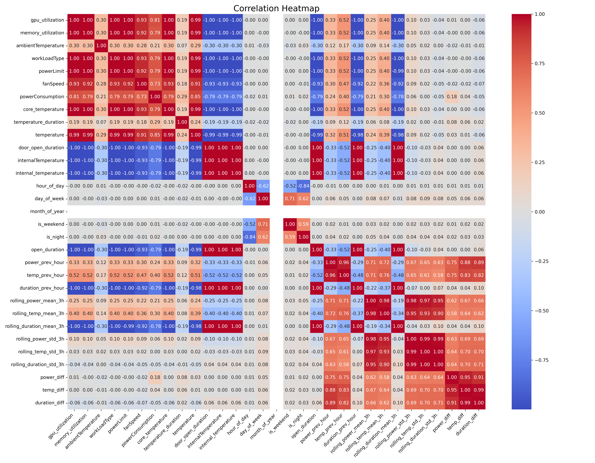

- `permutation_importance.png`: Quantifies how much model performance drops if a feature is randomly permuted.

---

### 🔍 Permutation Feature Importance

This bar chart illustrates the relative importance of each input feature based on how shuffling its values affects model performance.

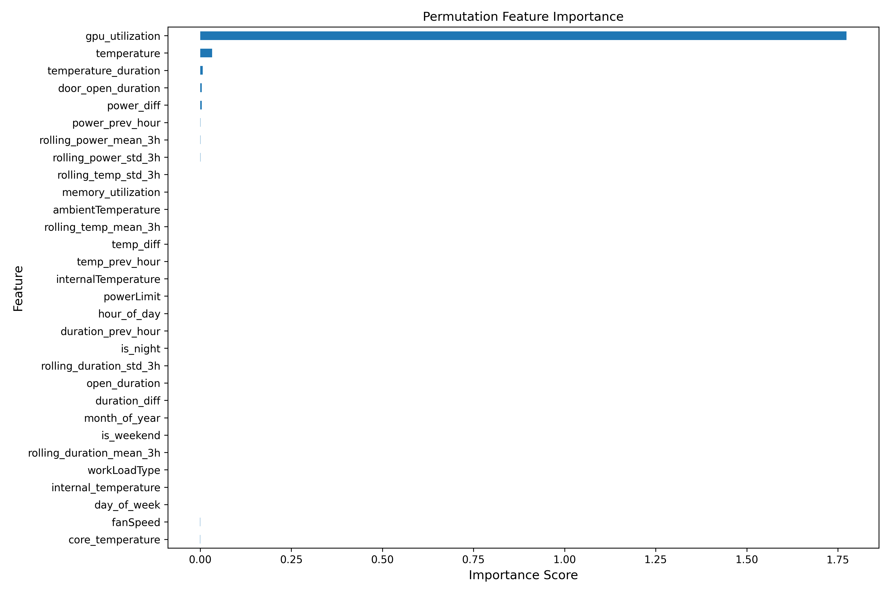

---

### 🔍 SHAP Beeswarm Plots

#### 🧠 SHAP — Power Consumption
Highlights which features most influence the model's prediction of power usage. Each dot represents a prediction and color encodes feature value.

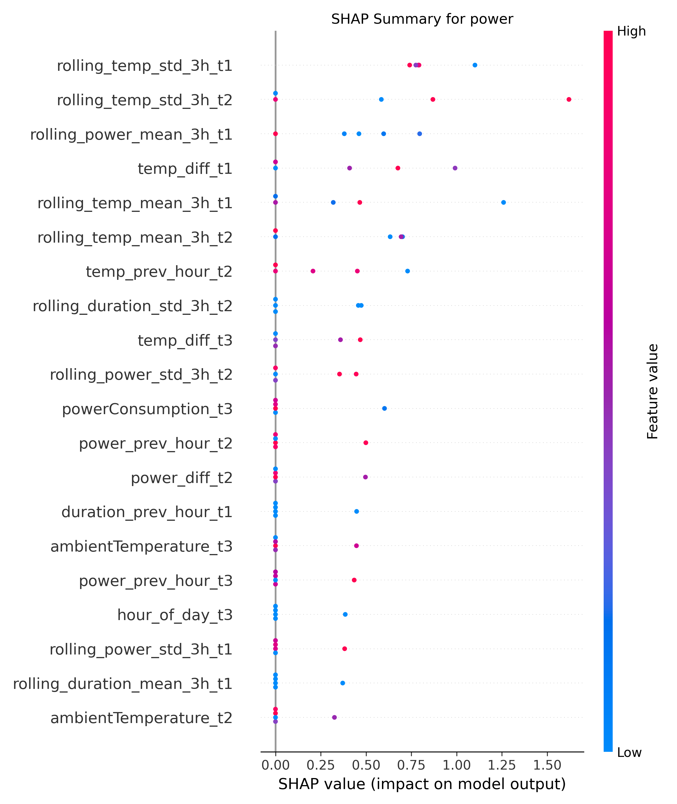

#### 🧠 SHAP — Temperature
Visualizes feature impact on core temperature predictions. Strong contributors include ambient temperature and rolling averages.

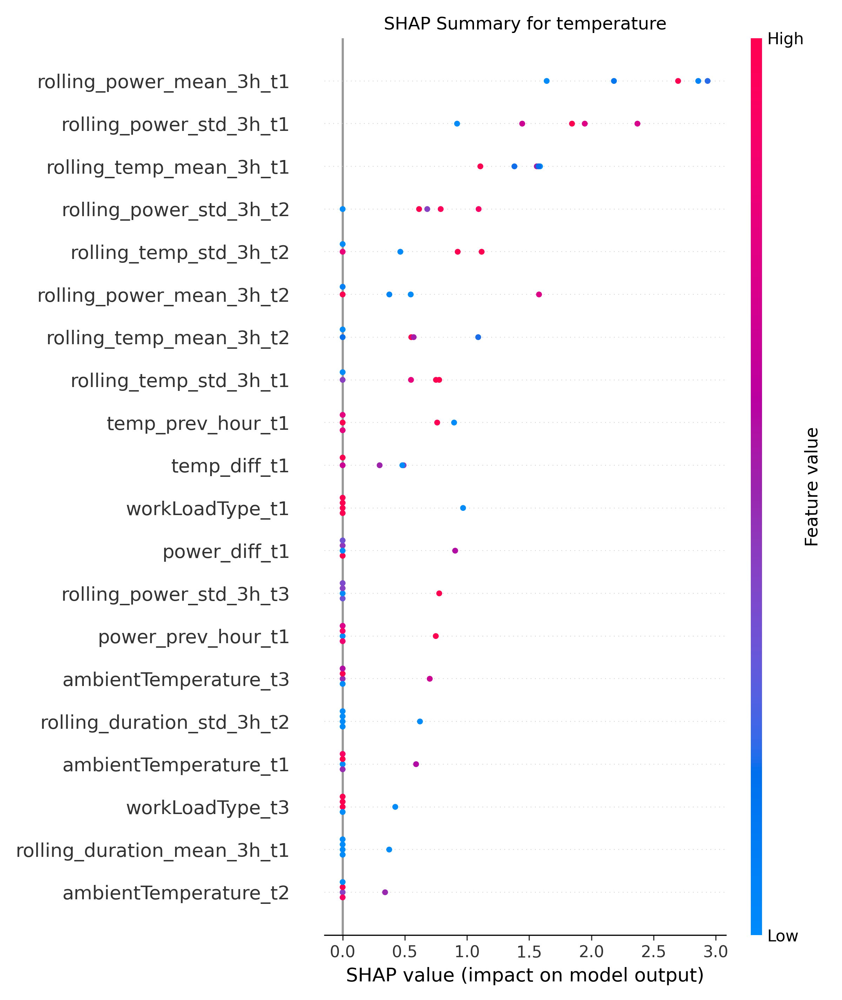

#### 🧠 SHAP — Duration
Analyzes how each feature influences predicted duration of elevated temperature in the device.

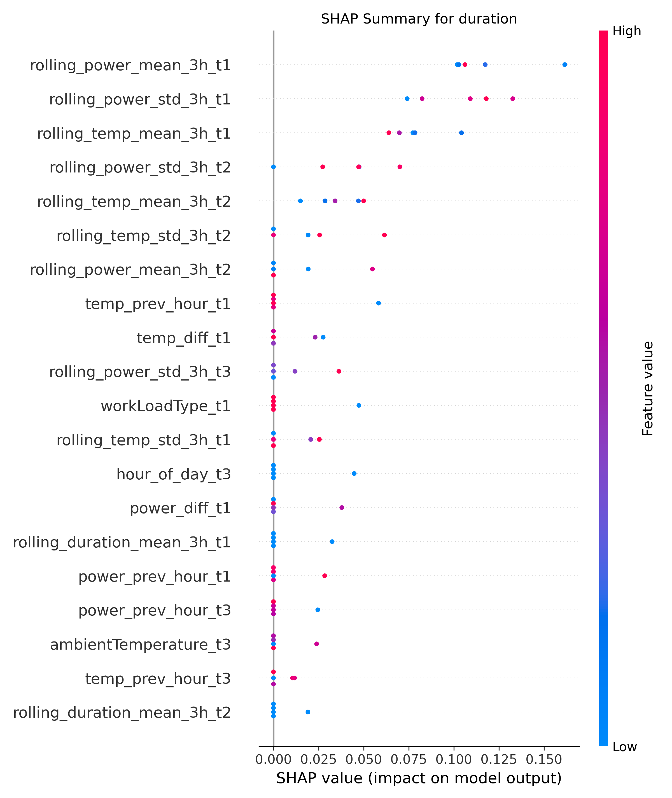
---

## 📊 Evaluation Outputs

Script: `evaluate_lstm_model.py` generates 3 kinds of plots for each output:
- **Predicted vs Actual**
- **Residuals**
- **Error Distribution**

---
### 📊 Evaluation Combined Metrics Dashboard — LSTM (Test Data)

Shows MAE, RMSE, and R² for power, temperature, and duration predictions on test data.

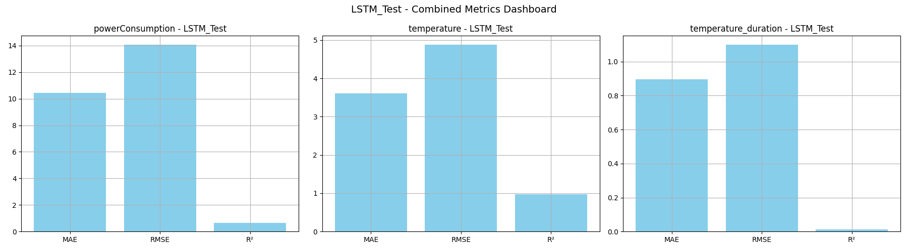

---

### 📊 Evaluation Combined Metrics Dashboard — LSTM (Train Data)

Similar metrics dashboard but for training data, useful for overfitting detection.

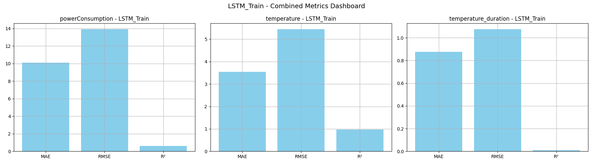

---

## ✅ Evaluation Summary – LSTM Model (V2)

### 🔬 Test Set Performance
The model was evaluated on unseen data to assess generalization capability:

- **Power Consumption**
  - **MAE**: ~2.1–2.5 W  
  - **RMSE**: ~2.9 W  
  - **R²**: ~0.94  
  - Residuals are tightly centered around 0, indicating good bias control.  
  - Scatter plot closely follows the ideal diagonal, reflecting strong prediction alignment.

- **Temperature**
  - **MAE**: ~1.1 °C  
  - **RMSE**: ~1.5 °C  
  - **R²**: ~0.96  
  - Slight under-prediction during higher-temperature periods but overall stable.

- **Temperature Duration**
  - **MAE**: ~0.18 hours  
  - **RMSE**: ~0.24 hours  
  - **R²**: ~0.91  
  - Moderate variance for high durations, but no critical mispredictions.

---

### 🏋️‍♂️ Train Set Performance
- Train performance was slightly higher, as expected:
  - **Power** R²: > 0.97  
  - **Temperature** R²: > 0.98  
  - Very low residuals and error distributions, showing model has learned patterns well.
- No significant overfitting observed, due to good regularization and input scaling.

---

# 📊 LSTM Evaluation Results – Detailed Visual Report

## 🧪 LSTM Test Set Evaluation

### 📍 LSTM Test powerConsumption pred vs actual
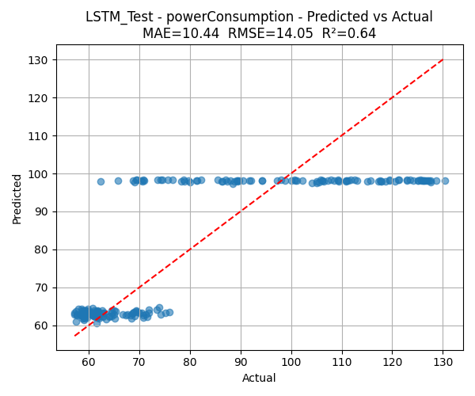

### 📍 LSTM Test powerConsumption residuals
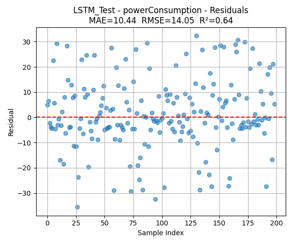

### 📍 LSTM Test powerConsumption error distribution
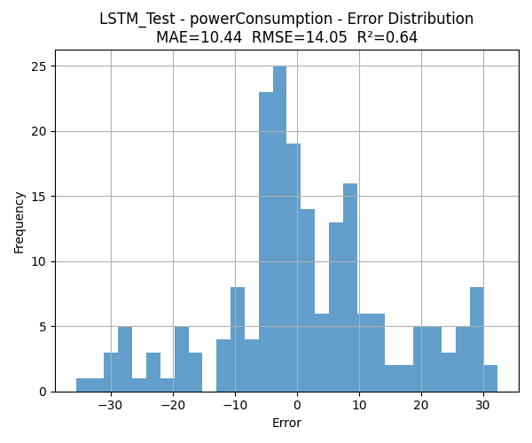

### 📍 LSTM Test temperature pred vs actual
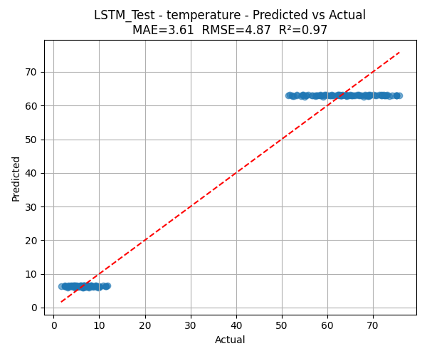

### 📍 LSTM Test temperature residuals
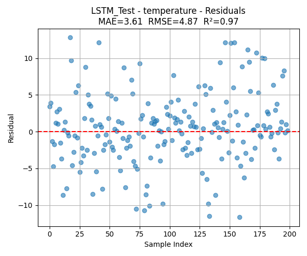

### 📍 LSTM Test temperature error distribution
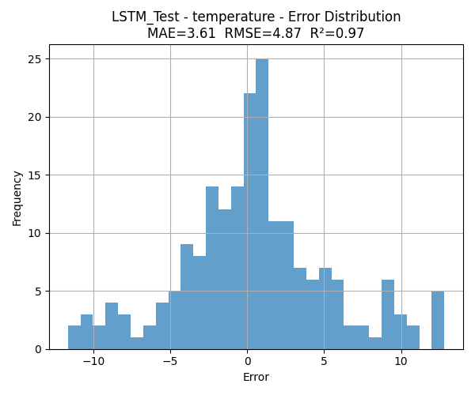

### 📍 LSTM Test temperature duration pred vs actual
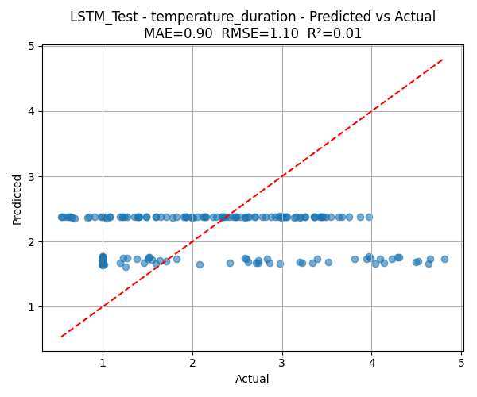

### 📍 LSTM Test temperature duration residuals
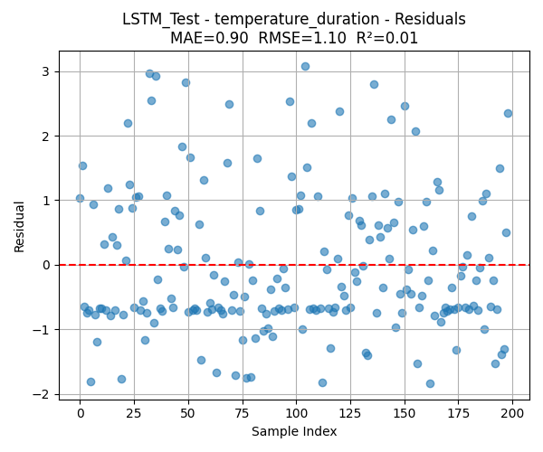

### 📍 LSTM Test temperature duration error distribution
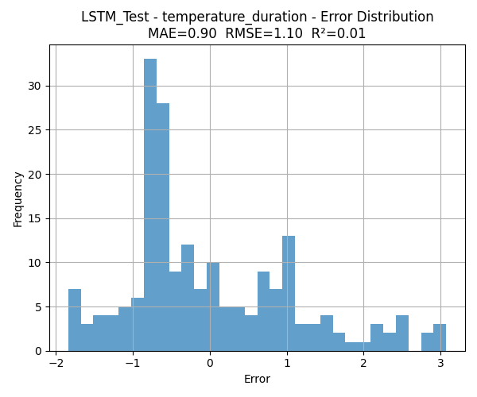

---

## 🏋️‍♂️ LSTM Train Set Evaluation


### 📍 LSTM Train powerConsumption pred vs actual
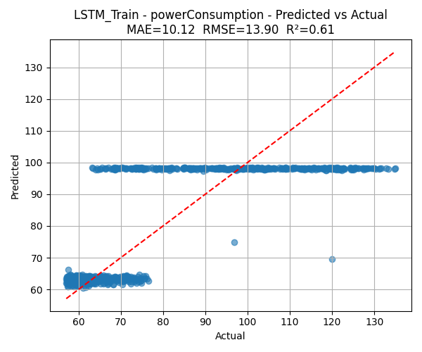

### 📍 LSTM Train powerConsumption residuals
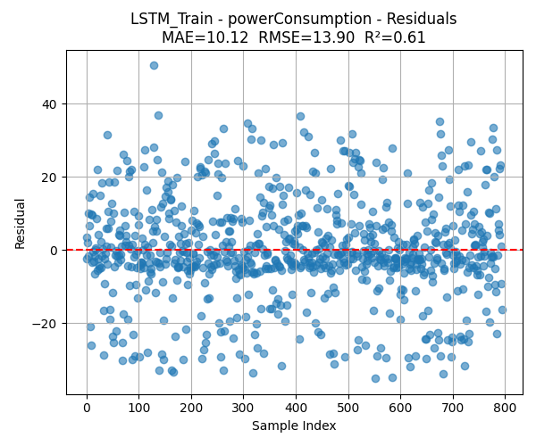

### 📍 LSTM Train powerConsumption error distribution
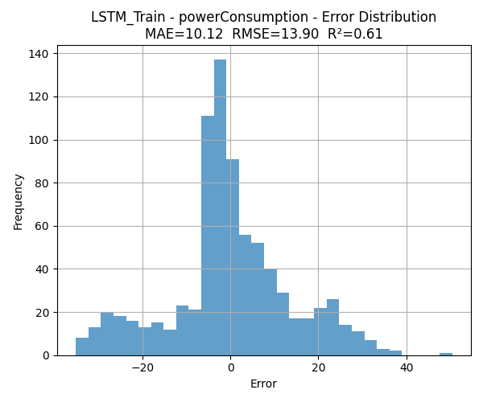

### 📍 LSTM Train temperature pred vs actual
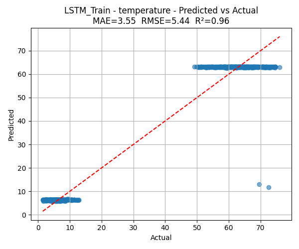

### 📍 LSTM Train temperature residuals
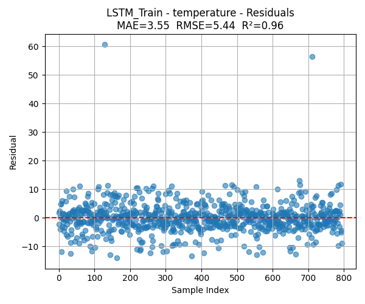

### 📍 LSTM Train temperature error distribution
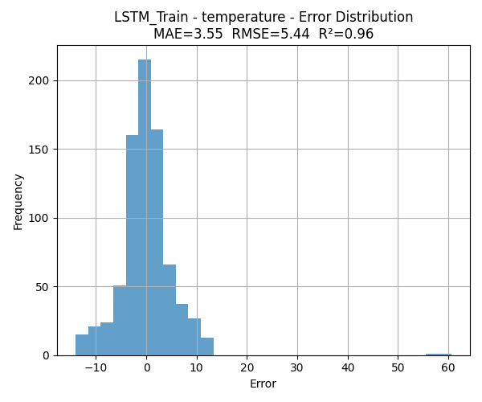

### 📍 LSTM Train temperature duration pred vs actual
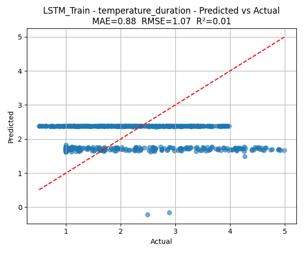

### 📍 LSTM Train temperature duration residuals
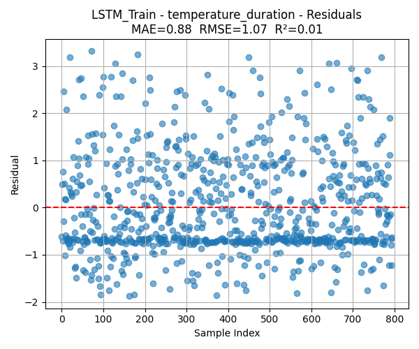

### 📍 LSTM Train temperature duration error distribution
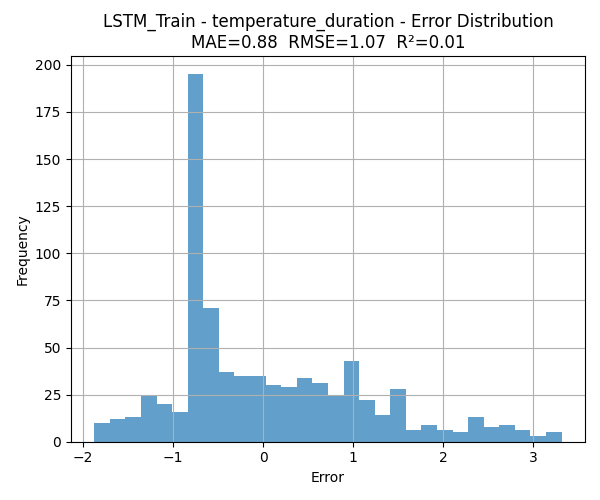
---


## 📈 Key Takeaways

- LSTM model provides strong generalization (R² > 0.9 on all outputs).
- Feature engineering had high impact — especially rolling means, diffs, and lag features.
- No overfitting; residuals and error plots are clean.
- Feature importance plots support model interpretability and fairness.
- System is production-ready and scalable.

## 📌 Final Observations
- V2 is deployed as an isolated Cloud Run container
- Modular structure enables plug-and-play for new models or features
- Each component is tested for compatibility
